# Advanced Computer Vision for Artificial Intelligence Group Project
 
# Authors:
**Matthias Bartolo** <br>
**Jerome Agius** <br>
**Isaac Muscat** <br>

## Introduction
In this project, object classification models like **ResNet50**, **VGG16**, and **MobileNet** were employed to classify images into two categories: those containing pizza and those that didn't. Subsequently, an annotated dataset encompassing diverse pizza types and ingredients was created using **RoboFlow**. This dataset was then used to train object-detection models—**YOLOv8**, **YOLOv5**, **RetinaNet**—aimed at identifying pizzas and their ingredients. Loss and accuracy graphs were generated for evaluation. Although a basic implementation of **DETR** was explored, it was not included in the final assessment. The culmination of these techniques led to the construction of a comprehensive pizza analysis system.
<br><br>

<p align='center'>
  
</p>

## Setup

The code for this research was executed on Google Colab, with provided environment files (`environment.yml` and `requirements.txt`) for local execution of object detectors. The main directory structure includes the following folders:

- **Papers:** Contains references to any papers cited in the documentation.
- **Part_1_Object_Classification:** Includes files pertinent to the Object Classification task.
- **Part_2_Building a Dataset:** Encompasses files related to the creation of an annotated dataset.
- **Part_3_Object_Detection:** Holds files related to the Object Detection task.
- **Part_3_Results:** Consists of diagrams or images created for evaluation of both object classification and object detection tasks.
- **pizza_data:** Contains the Kaggle Pizza Data Dataset [1].
- **pizza_classification:** Holds the Kaggle Pizza Classification Dataset [2].

<!-- <p align='center'>
  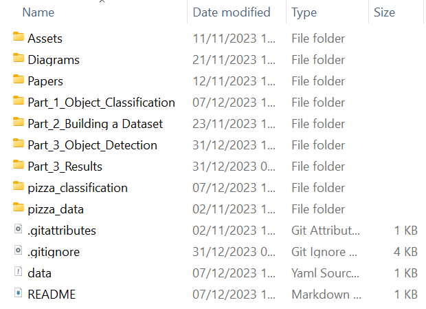
</p> -->

## Object Classification

Object classification is a core task in computer vision, involving the detection and categorization of objects based on predefined classes. Models trained on labeled datasets can assign labels to images with varying confidence levels, often requiring a threshold to filter low-confidence predictions.


### ImageNet
ImageNet (2009) is a widely used dataset for training computer vision models, though not directly utilized in this project. Pre-trained models with ImageNet weights were employed.

### VGG16
Introduced in 2014, VGG16 excels in image classification despite its relative simplicity compared to newer architectures, focusing on capturing intricate patterns within images.

### ResNet50
ResNet50 (2015) addresses deep network training issues using residual learning blocks and skip connections, enhancing accuracy in image recognition by overcoming the vanishing gradient problem.

### MobileNet
Designed in 2017 for mobile and edge devices with limited computational resources, MobileNet employs depth-wise separable convolutions, striking a balance between accuracy and efficiency for real-time applications.

Three classification models—ResNet50, VGG16, and MobileNet—were chosen for implementation in this study. Apart from their popularity, these models were selected due to their manageable computational requirements and diverse architectures. A Kaggle-retrieved dataset [2] was used for comparison purposes. Images were resized to 224x224 to accommodate model input size requirements, ensuring fair evaluation among the architectures.

<p align='center'>
<table align="center">
  <tr>
    <td align="center">
      
    </td>
    <td align="center">
      
    </td>
    <td align="center">
      
    </td>
  </tr>
</table>
</p>

Utilizing pre-trained weights from ImageNet, the classification process commenced by feeding images to each model. The predict function returned lists of tuples containing label identifiers, names, and associated confidence scores for each image. Top five labels per image, ranked by confidence, were displayed and saved into JSON files corresponding to each model used.

Despite their capability to classify various labels, these models were limited to classifying a pizza without distinguishing its toppings, as none were part of the known label list.

## Dataset Creation

Building a robust annotated dataset is a time-consuming process vital for object detection. It begins with dataset selection and label definition before the annotation process. Bounding boxes were used for this project, while other tasks might employ polygon annotation. Precise and consistent annotations are essential, facilitated by tools like Roboflow.

### Roboflow
Established in 2019, Roboflow is a user-friendly platform offering annotation, augmentation, and organization tools, aiding efficient dataset management.

### Annotated Pizza Dataset
For object detection, a Kaggle-sourced pizza dataset of around `9000` images was utilized [1]. Approximately `1500` images were annotated, focusing on `16` common pizza ingredients for labeling.

Chosen ingredient labels:
1. Arugula
2. Bacon
3. Basil
4. Broccoli
5. Cheese
6. Chicken
7. Corn
8. Ham
9. Mushroom
10. Olives
11. Onion
12. Pepperoni
13. Peppers
14. Pineapple
15. Pizza
16. Tomatoes

To streamline annotation and system performance, certain ingredients were omitted. Roboflow's tools were used for label management, bounding box creation, and image sorting.

### Data Preparation
Following annotation, the dataset was split into training, validation, and testing sets in a `60%-20%-20%` ratio. Augmentations, like rotation and blur, were exclusively applied to the training set, resulting in `2544`, `284`, and `283` images, respectively. The dataset was exported in various formats via Roboflow to suit object detection model requirements.

<p align='center'>
  
</p>

This meticulous dataset preparation laid the foundation for subsequent training and evaluation phases of the object detection model.

### Additional Roboflow Model (Roboflow 3.0)

Roboflow introduced its own model (**Roboflow 3.0**) utilizing the labeled dataset mentioned earlier for training. The dataset is available at https://app.roboflow.com/advanced-computer-vision-assignment/pizza-object-detector/deploy/7, while the resultant model can be accessed via the QR code or through the deployment dashboard displayed below.

<p align='center'>
<a href="https://app.roboflow.com/advanced-computer-vision-assignment/pizza-object-detector/deploy/7">
  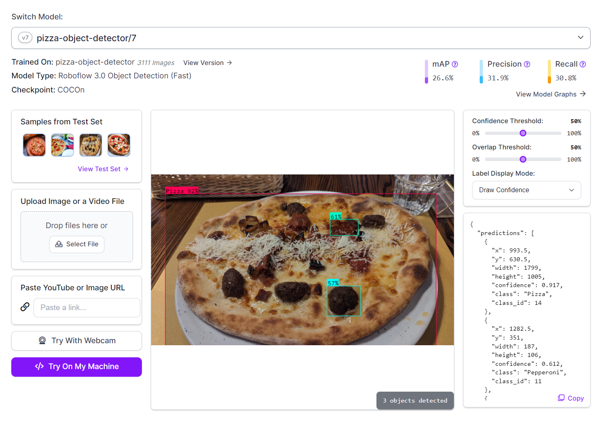
</a>
</p>

The QR code can be scanned to access the deployment dashboard below:
<p align='center'>
<a href="https://app.roboflow.com/advanced-computer-vision-assignment/pizza-object-detector/deploy/7">
  
</a>
</p>

To cite the dataset, please use the following BibTeX format:

```bib
@misc{ pizza-object-detector_dataset,
    title = { Pizza Object Detector Dataset },
    type = { Open Source Dataset },
    author = {Matthias Bartolo and Jerome Agius and Isaac Muscat},
    howpublished = { \url{ https://universe.roboflow.com/advanced-computer-vision-assignment/pizza-object-detector } },
    url = { https://universe.roboflow.com/advanced-computer-vision-assignment/pizza-object-detector },
    journal = { Roboflow Universe },
    publisher = { Roboflow },
    year = { 2023 },
    month = { nov },
}
```

## Object Detection

Object Detection in computer vision involves identifying objects and their locations within images or videos, incorporating bounding boxes and class labels. Unlike object classification, it pinpoints an object's position through bounding boxes and assigns appropriate class labels.

### RetinaNet
RetinaNet (2017) addresses class imbalance and localization with its Focal Loss, emphasizing difficult examples during training. Its feature pyramid network handles multi-scale features, making it proficient in complex, multi-scale object detection scenarios.

<p align='center'>
<table align="center">
  <tr>
    <td align="center">
      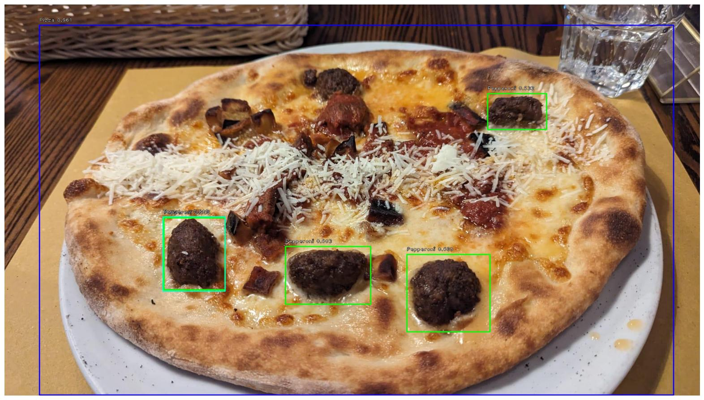
    </td>
    <td align="center">
      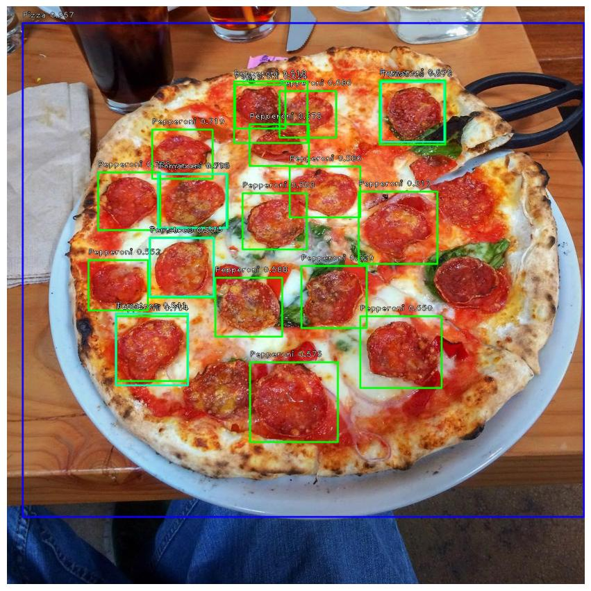
    </td>
  </tr>
</table>
</p>


### YOLOv5
YOLOv5 (2020) by Ultralytics improves YOLO's legacy with a more streamlined architecture, offering customization and multi-platform deployment. Variants like YOLOv5x and YOLOv5s cater to different computational requirements, focusing on simplicity, efficiency, and performance.

<p align='center'>
<table align="center">
  <tr>
    <td align="center">
      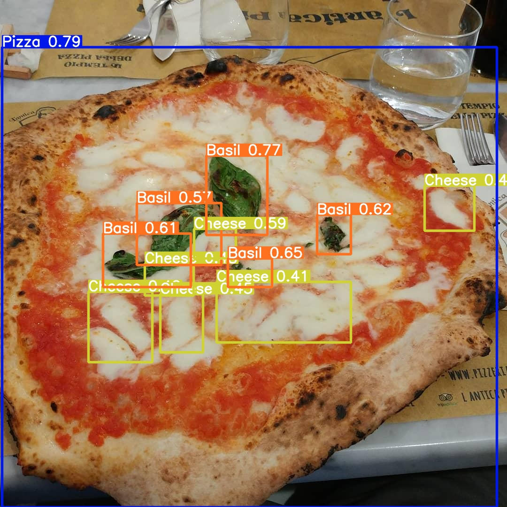
    </td>
    <td align="center">
      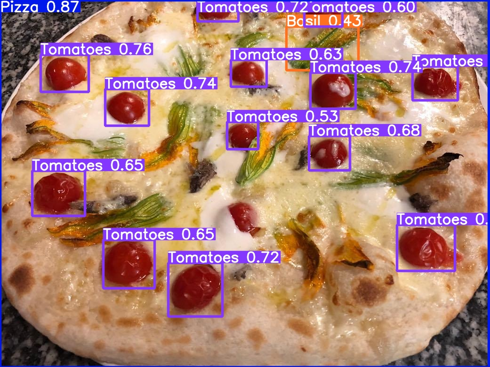
    </td>
  </tr>
</table>
</p>

### YOLOv8
YOLOv8 (2023) continues advancements, utilizing CSPDarknet53 for efficient image processing while maintaining high accuracy. Variants like YOLOv8-CSP and YOLOv8-Darknet provide options for different computational resources and use cases.

<p align='center'>
  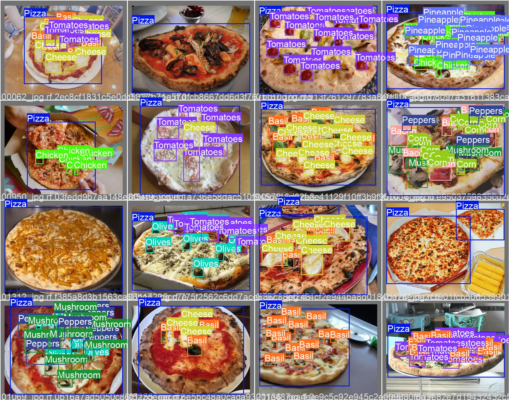
</p>

### DETR
DETR (2020) from Facebook AI Research replaces traditional anchor-based methods with transformers for end-to-end object detection. It handles multiple objects effectively in complex environments, especially with small-sized objects.

<p align='center'>
<table align="center">
  <tr>
    <td align="center">
      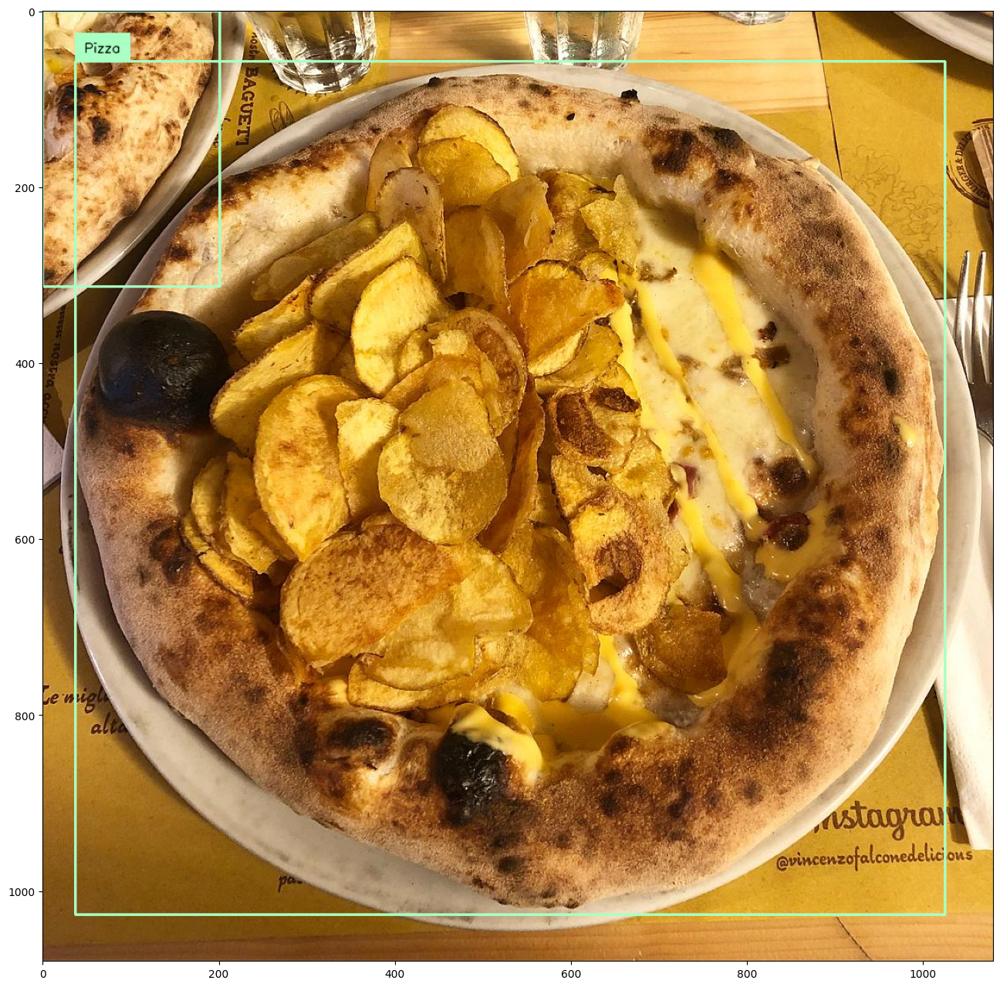
    </td>
    <td align="center">
      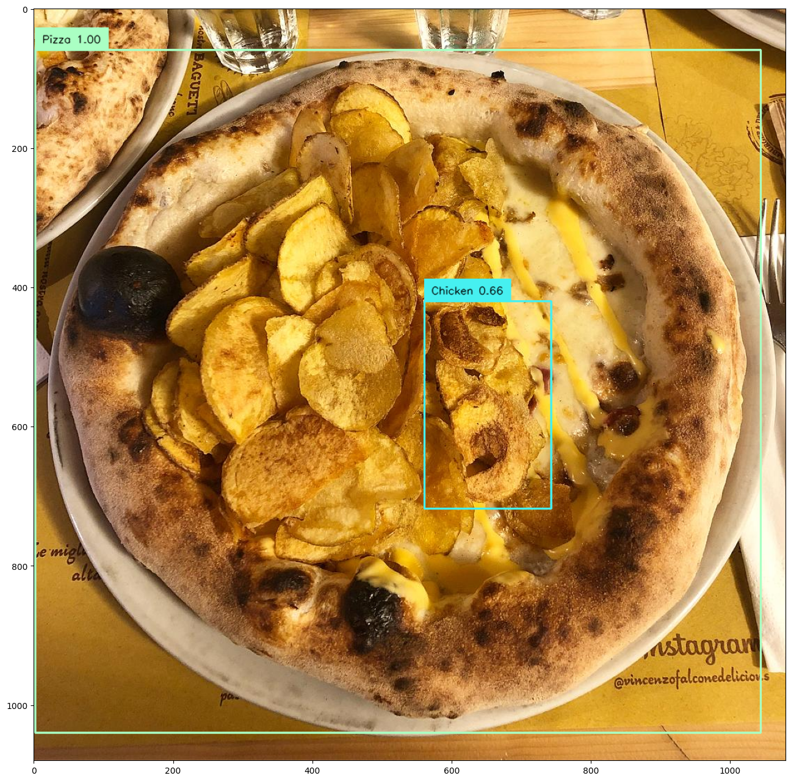
    </td>
  </tr>
</table>
</p>

The project implemented YOLOv5, YOLOv8, RetinaNet, and DETR for object detection, leveraging their specific strengths. Each model underwent dataset preparation, training, and evaluation. Post-training, examples of object detection in test images were showcased to assess model performance and capabilities.

## Evaluation

The evaluation compared YOLOv5, YOLOv8, RetinaNet, and DETR models. YOLOv8 showcased superior overall performance compared to YOLOv5, demonstrating better precision and recall in most scenarios despite the use of early stopping. While YOLOv5 displayed more consistent gradient reduction and higher precision at greater recall levels in precision-recall curves, YOLOv8 emerged as the best-performing model considering multiple evaluation metrics and curves. RetinaNet, an older architecture, showed lower precision but higher recall, producing acceptable results compared to modern YOLO architectures. Though DETR was implemented without specific graphs, a table with Average Precision and Recall values was provided, enabling comparison against other models. In summary, while YOLOv5 excelled in certain aspects, the comprehensive evaluation favored YOLOv8 as the top-performing model in this evaluation.

<p align='center'>
<table align="center">
  <tr>
    <td align="center">
      
      RetinaNet MAP Graph
    </td>
    <td align="center">
      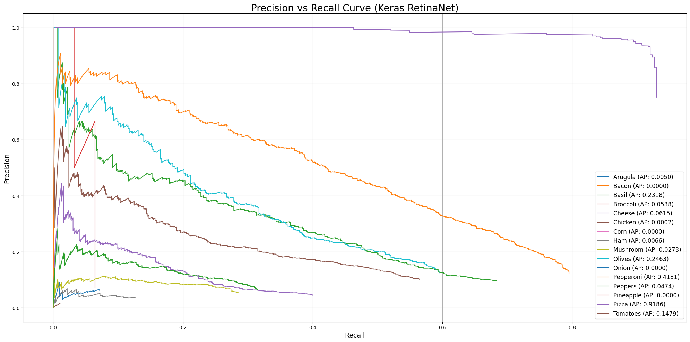
      RetinaNet PR Curve 
    </td>
  </tr>
</table>
</p>

<p align='center'>
<table align="center">
  <tr>
    <td align="center">
      
      YOLOv5 Confusion Matrix
    </td>
    <td align="center">
      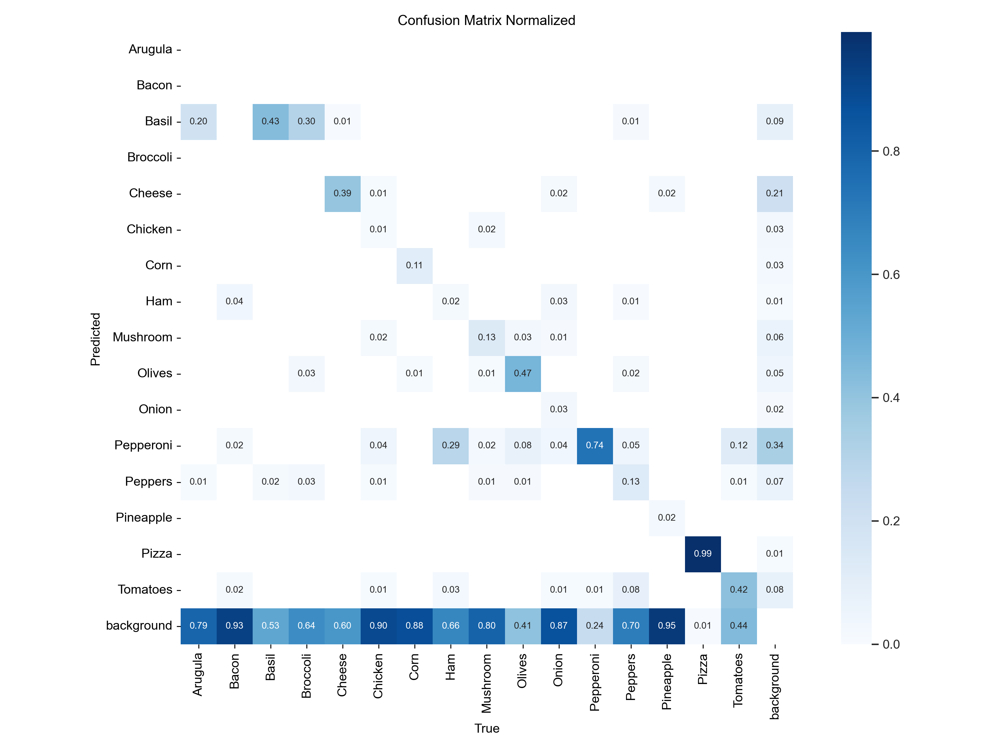
        YOLOv8 Confusion Matrix
    </td>
  </tr>
</table>
</p>

## Conclusion
The evaluation highlighted VGG16 as the top-performing image classifier, achieving the highest precision and F1-Score among the implemented models. For object detection tasks on a custom annotated pizza dataset, YOLOv8 emerged as the best-performing model, exhibiting superior curves compared to others. This study underscores the performance of various models in image classification and object detection tasks using a custom annotated dataset. While certain models excelled in this specific dataset, results could have varied with a different dataset selection. Additionally, the choice of pre-defined labels might have impacted the performance of object detection models.

## References

[1] M. Bryant, Pizza images with topping labels,
https://www.kaggle.com/datasets/michaelbryantds/pizza-images-with-topping-
labels/, Jun. 2019.

[2] Project_SHS, Pizza images with topping labels,
https://www.kaggle.com/datasets/projectshs/pizza-classification-data/, Dec.
2022.

<!-- The dataset which was used can be found through the following link: https://www.kaggle.com/datasets/michaelbryantds/pizza-images-with-topping-labels/

Classificaiton dataset: https://www.kaggle.com/datasets/projectshs/pizza-classification-data/

GitHub code from which we retrieved the ImageNet pizza images
https://github.com/mf1024/ImageNet-Datasets-Downloader/tree/master -->